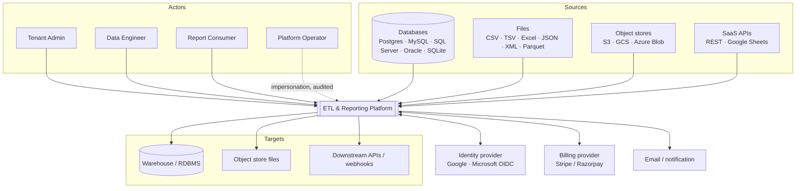
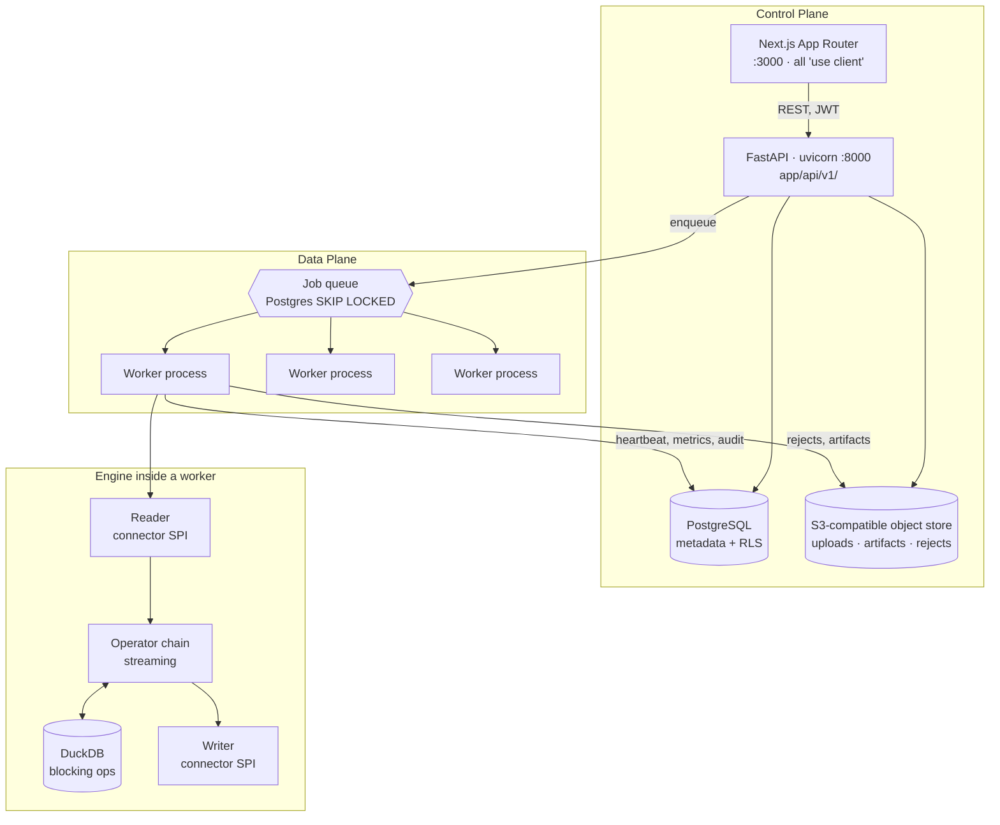
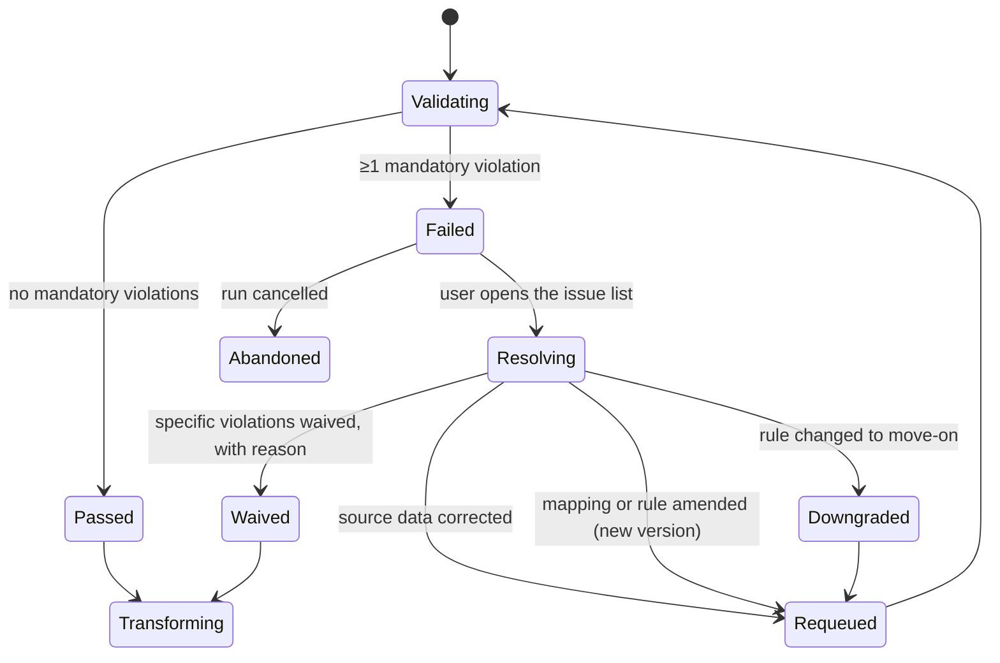
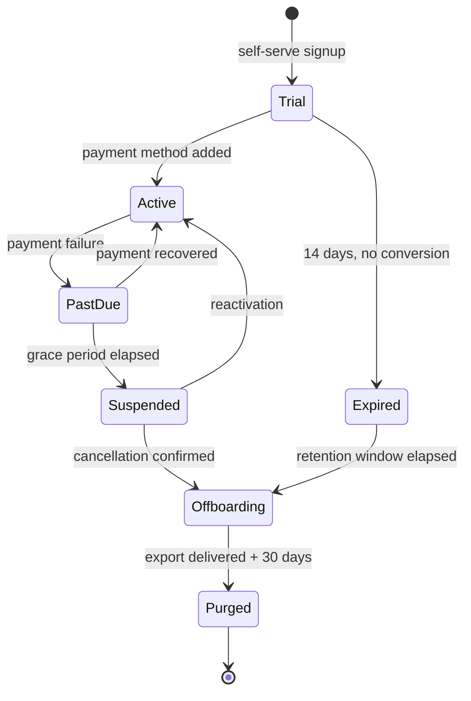

# Architecture — Lightweight Multi-Tenant ETL & Reporting Platform

**Status:** Draft v1 · **Date:** 2026-09-19 · **Audience:** architects, engineers

---

## 0. How to read this document

Section 1 fixes scope and the sizing envelope — everything downstream is justified by it.
Sections 2–6 describe the product's core loop (read → parse → transform → load).
Section 7 is the validation stage and its quality gate, which can stop that loop.
Section 8 is the multi-tenant SaaS model, called out separately because it cuts across
every component. Sections 9–16 cover reporting, audit, security, storage and operations.
Sections 17–21 record decisions, failure modes, the scaling path and what is still open.

A reader who only needs the shape of the system can stop after §4.

---

## 1. Purpose, scope and sizing

### 1.1 What this platform is

A self-service, multi-tenant SaaS product that lets a tenant:

1. **Connect** to any source whose contents can be read as rows and columns.

2. **Parse** that source into a single canonical tabular form, with schema inference.
   Where one source yields more than one tabular entity — several sheets in a workbook,
   several tables in a schema, several record types in one XML document — **each entity is
   taken as its own dataset with its own mapping**, not merged into one (§4.5). The entities
   found in a single connection are grouped as a *source bundle* so they can be created,
   edited and run together (§4.6).

3. **Validate** each dataset against declared rules before anything downstream sees it —
   column rules, row rules and dataset-wide rules, declared alongside the mapping (§7).
   Every rule is marked with one of two enforcement modes:

   - **Mandatory** — the pipeline does not advance while any mandatory rule is violated.
     The run halts at the gate, nothing is transformed or loaded, and the failures are
     shown in that page's own dashboard for the user to act on.
   - **Move on** — violations are recorded and surfaced, and the run proceeds to transform
     and load.

   While parsing and validation are running, that page carries a live dashboard docked to
   the **left rail or top panel**, showing gate status, progress, per-rule violation counts
   and sample failing rows (§7.6). It is watched during the stage, not read afterwards.

4. **Transform** it through a declarative, metadata-driven mapping — authored either as a
   **sync task** (one source, one target, field mapping and a filter, no DAG) or as a full
   **mapping** when the work needs joins, aggregation or branching. Two authoring surfaces,
   one execution path (§6.2).
5. **Load** it into any configured target.
6. **Report** on the loaded data through dashboards with drill-down.
7. **Audit** every one of the above actions, immutably.

### 1.2 What it is deliberately *not*

This is a small, sharp tool — "a baby ETL" — and the architecture only earns its keep if
that stays true. The following are explicit non-goals, and each one removes a large amount
of machinery:

| Non-goal | What it saves |
|---|---|
| Distributed execution (Spark, Dask, Flink) | No cluster manager, no shuffle, no executor lifecycle |
| Log-based CDC (Debezium, LogMiner) | No replication slots, no binlog parsing, no connector fleet |
| Sub-second / streaming pipelines | Batch scheduling only; no exactly-once stream semantics |
| Petabyte scale | Single-node execution per run stays viable |
| A separate OLAP cube or materialization engine | Reports query the target tables directly |
| Arbitrary user-supplied code execution | No sandbox, no container-per-step, far smaller attack surface |
| SCD Type 3–6, bitemporal history | Load modes stay at four (§5.5) |

If a requirement arrives that breaks one of these rows, it is a **re-architecture**, not a
feature. Section 19 describes the migration path for the two most likely ones.

### 1.3 Sizing envelope

The design target for v1. These are not aspirations — they are the numbers every component
below is sized against.

| Dimension | Target |
|---|---|
| Data volume | ≤ 5 GB/day per tenant; ≤ 50 GB/day platform-wide |
| Single source object | ≤ 2 GB (file) / ≤ 50M rows (table) |
| Concurrent runs | ≤ 8 per tenant, ≤ 64 platform-wide |
| Tenants | ≤ 500 active |
| Run latency | p95 < 10 min for a 1 GB source |
| Memory per run | Hard cap 2 GB RSS |
| Availability | 99.5% control plane; runs are retryable, not HA |

### 1.4 Design tenets

1. **Metadata-driven, not code-generating.** A mapping is data (JSON in Postgres), interpreted
   at runtime. No codegen, no compile step, no artifact registry.
2. **One canonical frame.** Every reader produces Arrow record batches; every writer consumes
   them. Connectors never see each other's formats. This is the single most important
   constraint in the system — it makes N sources × M targets an N+M problem.
3. **Streaming by default, spilling by exception.** Row batches flow reader → operators →
   writer. Only blocking operators (sort, aggregate, join, dedupe) materialize, and they
   delegate to DuckDB rather than implementing spill-to-disk by hand.
4. **Tenant isolation is a property of the data layer, not of application code.** Enforced by
   Postgres row-level security, so a forgotten `WHERE tenant_id = …` cannot leak data.
5. **Everything that changes state emits an audit event.** No exceptions, including
   platform-operator actions.
6. **Boring infrastructure.** Postgres is the metadata store, the job queue and the reporting
   source. Introducing Redis, Kafka or a scheduler daemon must be justified against §17.

---

## 2. System context



---

## 3. Logical architecture

Two planes. The **control plane** is interactive and always-on; the **data plane** is batch,
horizontally scaled by process count, and holds no durable state of its own.



### 3.1 Components

| Component | Responsibility | Scales by |
|---|---|---|
| **Web app** (Next.js) | Mapping designer, run monitor, dashboards, tenant admin | CDN / replicas |
| **API** (FastAPI) | AuthN/Z, CRUD on metadata, validation, enqueue, report queries | Replicas behind nginx |
| **Metadata store** (Postgres) | Tenants, users, connections, mappings, runs, audit, usage | Vertical; read replica for reports |
| **Object store** (MinIO / S3) | Uploaded files, run artifacts, rejected rows, exports | Native |
| **Queue** (Postgres table) | Durable, transactional work handoff | Shares Postgres |
| **Worker** | Executes one run at a time, end to end | Process count |
| **Scheduler** | Materializes cron schedules into queued runs | Single leader-elected process |

### 3.2 Why the API never touches tenant *data*

The API reads and writes **metadata** (mappings, run state) and issues **read-only, governed
queries** against target tables for reporting. It never streams source data. All bulk I/O
happens in workers. This keeps request latency bounded and prevents a large extract from
exhausting API memory.

---

## 4. The connector framework

The pivot point of the whole design: a narrow interface that every source and target
implements, so the engine knows nothing about file formats or database dialects.

### 4.1 Source SPI

```python
class SourceConnector(Protocol):
    def test(self, conn: ConnectionConfig) -> HealthResult: ...

    def discover(self, conn: ConnectionConfig) -> list[ObjectSpec]:
        """Tables, files, sheets, endpoints — whatever this source exposes."""

    def infer_schema(self, conn: ConnectionConfig, spec: ObjectSpec) -> Schema:
        """Arrow schema + per-column confidence and sample values."""

    def read(
        self,
        conn: ConnectionConfig,
        spec: ObjectSpec,
        *,
        watermark: Watermark | None,
        batch_rows: int,
    ) -> Iterator[pa.RecordBatch]:
        """Yield Arrow batches. Must be resumable from `watermark`."""
```

### 4.2 Target SPI

Writers are transactional at the batch level, with a two-phase shape so a failed run cannot
leave a half-loaded target:

```python
class TargetConnector(Protocol):
    def begin(self, conn, spec, schema, mode: LoadMode) -> LoadSession: ...
    def write(self, session: LoadSession, batch: pa.RecordBatch) -> None: ...
    def commit(self, session: LoadSession) -> LoadResult: ...
    def abort(self, session: LoadSession) -> None: ...
```

For RDBMS targets, `begin` creates a staging table, `write` bulk-copies into it, and `commit`
performs the atomic swap or merge. Object-store targets write to a temp prefix and rename.

### 4.3 Making non-tabular sources tabular

"Any source readable in tabular format" includes formats that are not natively tabular. These
are handled by a **shredding config** on the source, not by bespoke connectors:

| Format | Config | Notes |
|---|---|---|
| CSV/TSV | delimiter, quoting, encoding, header row | Encoding sniffing incl. UTF-16 + BOM |
| Excel | sheet, header row, range | Merged cells flattened forward |
| JSON / NDJSON | `record_path`, `field_paths` | JSONPath per column |
| **XML** | `record_xpath`, `field_xpaths`, namespace map | Streaming (`iterparse`), never DOM |
| Parquet / Arrow | — | Native, zero-copy |
| Fixed-width | column offsets + widths | |

Two hard-won rules apply to the semi-structured readers, and they belong in the architecture
rather than in connector code because they determine memory behaviour:

1. **Never build a tree.** XML and JSON readers must stream and release each record after
   emission, or a 150 MB document becomes multi-GB of objects.
2. **A record delimiter is part of the contract, not an inference.** Flat exports (many
   reporting tools emit a flat element stream with no record nesting) need an explicit
   delimiter tag and a state machine. The reader declares which mode it is in —
   `nested` or `delimited` — and refuses to guess.

### 4.4 Schema inference and drift

`infer_schema` samples the first N rows (default 10k) and proposes types, which the user
confirms in the designer; the confirmed schema is then **pinned to the mapping version**.
On each run the actual schema is compared against the pinned one:

| Drift | Default policy | Configurable to |
|---|---|---|
| New source column | Ignore, warn | Fail · auto-add to target |
| Missing source column | Fail | Null-fill |
| Type widened (int→bigint) | Accept | Fail |
| Type narrowed / incompatible | Fail | Coerce with rejects |

Drift decisions are audit events, because they silently change what lands in the target.

**Sensitivity proposal.** Inference also guesses which columns hold sensitive values — by
name and by pattern, against the platform's format catalogue — and returns a `sensitivity`
suggestion alongside each column's type: `pan`, `aadhaar`, `mobile`, `account`, `email`,
`none`. A confirmed sensitivity attaches two things automatically: the matching format
validation rule (§7.8) and a `mask` operator (§5.3) on any target the mapping marks
non-production.

This is pattern matching over a regex catalogue, not a model, and it is a **proposal**: the
author confirms or clears each one, and nothing is applied silently. Its value is that PII
protection stops depending on every mapping author remembering — the platform raises its hand
first. Accepting or rejecting a proposal is an audit event.

### 4.5 One entity, one mapping

A single source location rarely holds a single table. An Excel workbook has sheets, a database
has tables, an XML export has several record types, a folder glob matches many files. The rule
throughout the platform:

> **Every discovered entity becomes its own dataset, and every dataset gets its own mapping.**

The rule is about the unit, not the authoring surface: that mapping may be written as a sync
task or as a full mapping (§6.2). Either way it is one mapping per dataset.

`discover()` returns a list of `ObjectSpec`; the user selects which to bring in; the platform
creates one **Dataset** and one **Mapping** per selection, each with its own pinned schema,
its own validation rules, its own run history and its own gate.

| Source | Entities discovered | Result |
|---|---|---|
| `orders.xlsx` with 3 sheets | `Orders`, `Lines`, `Customers` | 3 datasets, 3 mappings |
| Postgres schema with 40 tables | 40 tables | 1 dataset + mapping per selected table |
| Folder glob `sales_*.csv` (same shape) | 1 logical entity, many files | **1** dataset; files are partitions of it |
| XML with `<VOUCHER>` and `<LEDGER>` records | 2 record paths | 2 datasets, 2 mappings |

The glob row is the important exception: many files of the *same shape* are one entity, not
many. The distinction is whether the schemas match — same shape means partitions of one
dataset; different shapes mean different datasets.

Why one mapping per entity rather than one mapping with many branches:

- **Independent failure.** A bad `Customers` sheet must not block a clean `Orders` load.
- **Independent schema and drift policy.** Each entity pins its own schema (§4.4).
- **Independent validation.** Rules and gates are per dataset (§8.1) — this is what makes the
  gate meaningful; a gate spanning unrelated entities would be either too coarse or useless.
- **Independent scheduling and incremental state.** Each dataset carries its own watermark.
- **Simple lineage.** One source entity → one mapping → one target is a line, not a graph.

### 4.6 Source bundles

Creating forty mappings by hand would make the fan-out rule a burden rather than a feature, so
discovery-to-mappings is a single action. A **Source Bundle** is the grouping object: it
records the connection, the discovery result, and the datasets created from it.

A bundle provides:

- **Bulk creation** — select entities, apply a naming convention and a shared target prefix,
  and the platform generates one mapping per entity with inferred schemas and any rule set
  applied to all of them.
- **Bulk edit** — add a validation rule or change a target connection across every dataset in
  the bundle in one action, each edit producing a new version of each affected mapping.
- **Run groups** — running a bundle enqueues its datasets as a group under one `run_group_id`,
  so progress and gate status roll up to a single view.
- **A gate policy**, deciding how one dataset's closed gate affects its siblings:

| Bundle policy | Behaviour when a dataset's gate closes | Use for |
|---|---|---|
| `independent` (default) | Siblings continue and load normally | Unrelated entities in one workbook |
| `all_or_nothing` | Siblings that have not yet loaded are held; already-loaded siblings are rolled back where the target supports it | Entities with referential dependencies (header/detail) |
| `halt_dependents` | Only datasets declared downstream of the failed one are held | Explicit dependency edges between datasets |

`all_or_nothing` is the honest choice when loading a parent and child together; it is not the
default because it converts an isolated data-quality problem into a bundle-wide outage, which
is the wrong trade for the majority of cases.

---

## 5. Execution model

### 5.1 The phases

The familiar lifecycle, scaled down, with the quality gate made explicit:
**Extract → Scrub → Validate ⟨gate⟩ → Transform → Load.**

Three stages that are often collapsed into one are kept apart here, because each fails
differently and each needs a different response:

| Stage | Failure character | Response |
|---|---|---|
| **Scrub** (*Cleanse* in the UI) | Row-level, expected — a malformed value in an otherwise good file | Clean, flag or reject the row; run continues |
| **Validate** | Dataset-level judgement — does this data meet the declared contract? | Gate: halt or proceed, per rule enforcement (§7.3) |
| **Transform** | Definition-level, exceptional — the mapping itself is wrong | Fail the run; the mapping needs fixing |

```
 ┌────────┐   ┌───────┐   ┌──────────┐  gate   ┌───────────┐   ┌──────┐
 │ Extract├──►│ Scrub ├──►│ Validate ├────────►│ Transform ├──►│ Load │
 └────────┘   └───┬───┘   └────┬─────┘  open   └─────┬─────┘   └──────┘
                  │ rejects    │ closed              │ blocking ops
                  ▼            ▼                     ▼
           reject store   run halts,            DuckDB spill
              (S3)        issues → dashboard
```

### 5.2 Process and memory model

One run = one OS process, single-threaded pipeline with two I/O threads:

- **Reader thread** → bounded queue (default 4 batches) → **transform generator chain** →
  bounded queue → **writer thread**.
- Bounded queues give natural backpressure: a slow target throttles the reader without
  unbounded buffering.
- Batch size adapts to stay under the memory cap: start at 50k rows, halve on memory
  pressure, floor at 1k.
- A cgroup memory limit of 2 GB per worker turns a runaway run into a clean `OOMKilled`
  that the supervisor records as a failed run, not a node-wide outage.

### 5.3 Streaming vs blocking operators

| Streaming (constant memory) | Blocking (delegated to DuckDB) |
|---|---|
| project, rename, cast | sort |
| filter | group-by / aggregate |
| derive (expression) | join |
| lookup (cached dim ≤ 1M rows) | distinct / dedupe |
| mask (hash · redact · partial · tokenise) | |
| router (branch by condition), union | window functions |
| sequence (generated keys) | |
| validate / scrub rules | pivot / unpivot |

Operator names follow the Informatica vocabulary wherever the operation is the same one, so
that someone from a PowerCenter or IICS background finds what they expect: `router` rather
than our earlier `split`, `cleanse` as the UI label for the scrub phase. Step **instances**
carry a prefix naming their operator — `exp_` for `derive`, `rtr_` for `router`, `lkp_` for
`lookup` — which is why a log line is readable without the canvas. The full prefix table and
the rules that enforce it are in the companion document, *Definitions and naming conventions*;
§6.6 states the parts the platform validates.

**`mask` deserves a note**, because it is the only operator that exists for a reason other
than shaping data. Masking elsewhere in this document happens on the way *out* — reporting
(§9.5), the review grid (§15.1), role gating (§11.1). Those protect a value that is already
sitting in the target. `mask` protects the target itself: applied in the chain, the sensitive
value is transformed *before* the writer sees it, so a non-production database loaded from
production files never receives a real PAN or Aadhaar at all. Read-time controls cannot help
once someone queries that database directly, and on a UAT box someone will.

Modes: `hash` (deterministic, so joins still work), `redact` (fixed replacement),
`partial` (keep first/last n), `tokenise` (reversible via the vault, privileged). Applying
`mask` is recorded on the run, because "was this load masked?" is an audit question.

When the chain hits a blocking operator, batches up to that point are registered as a DuckDB
view; DuckDB executes the blocking step and its output is streamed back as Arrow. DuckDB
handles spilling to disk, so the engine never implements external sort.

### 5.4 Expressions

A small, safe expression language — **not** Python `eval`:

- Parsed to an AST, type-checked against the pinned schema at save time, so an invalid
  expression is rejected in the designer rather than at 3 a.m. in a run.
- Vectorized evaluation over Arrow arrays via a compiled-to-DuckDB-SQL path.
- Function library: string, numeric, date/time, null handling, regex, conditional, hashing,
  lookup, and the masking functions behind the `mask` operator (§5.3). No I/O functions, no
  loops, no user-defined functions in v1 (§1.2).

### 5.5 Load modes

| Mode | Semantics | Idempotency |
|---|---|---|
| `append` | Insert all rows | Guarded by `run_id` marker column |
| `truncate_load` | Empty target, then insert | Naturally idempotent |
| `upsert` | Merge on declared natural key | Naturally idempotent |
| `scd2` | Close and open dated versions on key change | Idempotent via effective dates |

### 5.6 Incremental extraction

Watermark-based only (no CDC, per §1.2). The mapping declares a watermark column —
timestamp, monotonic id, or file modification time. The engine:

1. Reads the last committed watermark from `runs`.
2. Extracts rows strictly greater than it.
3. Commits the new high-water mark **only** in the same transaction that commits the load.

A configurable **lookback window** (default 0, commonly 1 hour) re-reads a trailing slice to
tolerate late-arriving rows in sources whose timestamps are set at insert rather than commit —
a classic source of silent gaps.

### 5.7 Recovery

Runs are resumable at batch boundaries. Each committed batch advances a checkpoint
(`run_id`, `spec`, `offset`, `watermark`). On worker death, the supervisor requeues the run;
it resumes from the last checkpoint if the target supports it (staging tables, object prefixes)
and restarts cleanly otherwise. Retries are bounded (default 3) with exponential backoff, then
the run is parked as `failed` for human attention.

---

## 6. The mapping model

A mapping is the unit of design, versioning and execution — a DAG of typed steps stored as
JSON and validated against a schema.

### 6.1 Structure

```jsonc
{
  "mapping_id": "map_7f3a…",
  "version": 4,
  "name": "Tally vouchers → warehouse",
  "parameters": [
    { "name": "target_conn", "type": "connection", "required": true },
    { "name": "as_of_date",  "type": "date", "default": "$run_started_at" },
    { "name": "branch",      "type": "string", "required": false }
  ],
  "source": {
    "connection_id": "conn_…",
    "spec": { "kind": "file", "path": "uploads/…/Transactions.xml",
              "format": "xml",
              "record_xpath": "//TALLYMESSAGE/VOUCHER",
              "field_xpaths": { "guid": "GUID/text()", "date": "DATE/text()" } },
    "incremental": { "watermark_column": "alter_id", "lookback": "PT0S" }
  },
  "steps": [
    { "id": "s1", "op": "scrub",   "rules": [
        { "column": "date", "rule": "date_format", "args": { "format": "%Y%m%d" },
          "on_fail": "reject" } ] },
    { "id": "s2", "op": "derive",  "column": "amount_abs", "expr": "abs(amount)" },
    { "id": "s3", "op": "filter",  "expr": "is_cancelled = 'No'" },
    { "id": "s4", "op": "aggregate", "group_by": ["ledger"],
      "aggregates": [ { "column": "amount", "fn": "sum", "as": "total" } ] }
  ],
  "target": {
    "connection_id": "conn_…",
    "spec": { "table": "analytics.voucher_totals" },
    "mode": "upsert",
    "natural_key": ["ledger"],
    "column_map": { "ledger": "ledger_name", "total": "total_amount" }
  },
  "on_error": { "max_reject_rows": 1000, "max_reject_pct": 5.0 }
}
```

**Parameters.** Without them the same logical job against two environments is two mappings,
and a windowed extract cannot be re-run for a different window without editing its definition.
So a mapping declares `parameters`, and a reference `{{ p.<name> }}` is substituted into
connection ids, object names, filter and derive expressions, and target names.

- **Types** are declared, not inferred: `connection`, `string`, `int`, `date`, `secret`.
  A `connection` parameter resolves to a connection the caller is allowed to use — it is
  a reference, never a host and password in a string.
- **Values** arrive at run time: from the API call, from the schedule's parameter set (§13),
  or from a parameter set stored per environment. Missing a required parameter fails the run
  at admission, not halfway through.
- **The values used are pinned onto the run** (§12.1). A run stays reproducible: the mapping
  version *and* the inputs it ran with are both recorded.
- **System variables** the engine supplies and a mapping may reference without declaring:
  `$run_id`, `$run_started_at`, `$dataset`, `$watermark_previous`.
- A `secret` parameter is never written to the run record, the audit diff or the logs — only
  the fact that it was supplied.

### 6.2 The two authoring tiers

Most jobs are not complicated. A table moved to a warehouse with three fields normalised does
not need a DAG canvas, and making someone open one is friction paid every single day. But some
jobs genuinely need joins and aggregation, and a wizard cannot express those. So the platform
offers **two authoring surfaces over one execution path**.

| | **Sync task** | **Mapping** |
|---|---|---|
| Shape | One source → one target, linear | A DAG |
| Authoring | Wizard: pick source, pick target, map fields, add a filter, choose a load mode | Canvas: steps, branches, inspectors |
| Can express | project, rename, cast, derive, filter, scrub rules, validation rules | all of that, plus join, aggregate, sort, distinct, union, router, lookup, window, pivot |
| Cannot express | joins across sources, aggregation, branching, more than one target | — |
| Typical use | Recurring load of a known file or table | Anything that reshapes, combines or summarises |

**They are the same object underneath.** A sync task *is* a mapping: the wizard emits the
same definition JSON of §6.1, with a linear `steps` chain, and it is stored in the same
table under `kind = 'sync'` (§12.1). Nothing downstream — the gate (§7), the engine (§5),
runs, lineage, audit, scheduling — knows or cares which surface produced it. That is the
whole point of the split, and the reason it costs so little: one column and one wizard, not
a second pipeline.

**Promotion is one-way.** A sync task can be opened as a mapping and gains the full step
palette; a mapping cannot be reduced back to a sync task, because the DAG can express shapes
the wizard has no way to render. The UI states this before converting, since it is a door that
closes. Promotion produces a new mapping version (§6.3) like any other edit, so the run history
of the task survives the change.

**Which is the default.** New datasets start as sync tasks. The mapping designer is opened
deliberately, when the wizard cannot say what the job needs — not as the standard entry point
for work that does not require it.

### 6.3 Versioning and promotion

- Mappings are **immutable once run.** Editing creates version *n+1*; runs pin the version
  they executed, so a run is always reproducible and an audit trail is always interpretable.
- Promotion across environments (dev → prod) exports the mapping with connection references
  resolved by *alias*, not id, so the same mapping binds to different credentials per
  environment.
- A mapping and its versions are tenant-scoped; there is no cross-tenant sharing in v1
  beyond platform-curated templates.

### 6.4 Design-time checks

Not to be confused with the data quality gate (§7), which judges *rows*; these judge the
*definition*, at save time. Save is rejected unless: the DAG is acyclic and fully connected; every referenced column
exists in the pinned schema; every expression type-checks; the target column map covers all
non-nullable target columns; and the natural key is present for `upsert`/`scd2`.

A mapping that **references a mapplet** (§6.5) is checked against the mapplet's declared
inputs and outputs, not by inlining it — so a mapplet change that breaks a consumer is caught
when the mapplet is published, against every mapping that uses it.

Save is also rejected on the naming rules of §6.6. Those are design-time checks, not a style
guide: a convention nobody enforces is a convention nobody follows.

### 6.5 Mapplets: reusable step blocks

The same normalisations recur across every dataset in a domain — mobile number, PAN case,
date format, gender enum. Declaring them per mapping means fixing a bad regex in nine places
and missing the tenth.

A **mapplet** is a named, versioned block of steps with declared inputs and outputs, which a
mapping references rather than copies:

```jsonc
{ "id": "s0", "op": "mapplet", "ref": "mplt_kyc_normalise", "version": 3,
  "bind": { "mobile": "contact_no", "pan": "pan_number" },
  "override": { "mobile.strip_country_code": false } }
```

- **Versioned and pinned**, exactly like a mapping (§6.3). A mapping references version 3 and
  keeps getting version 3 until someone upgrades it — a mapplet cannot change under a running
  pipeline.
- **Bound, not inlined.** The consuming mapping maps its own column names onto the mapplet's
  declared inputs, so the same block serves datasets with different column names.
- **Overridable per use**, and the override is recorded on the consuming mapping so the
  deviation is visible when auditing.
- **Tenant-scoped**, like rule sets (§7.8) — which this deliberately mirrors. Rule sets do
  this for validation; mapplets do it for transformation. Same shape, same lifecycle, and
  worth keeping symmetrical so there is one concept to learn rather than two.

Upgrading a mapplet is a deliberate act on each consumer, and the designer shows which
mappings are behind.

### 6.6 Naming

The full convention — every prefix, the flow and action tokens, the terms deliberately not
adopted — is the companion document, *Definitions and naming conventions*. What matters here
is the part the platform **enforces at save** (§6.4), because an unenforced convention decays:

1. **Objects carry a type prefix**: `m_` mapping, `s_` sync task, `mplt_` mapplet, `rs_` rule
   set, `ps_` parameter set, `cn_` connection, `sch_` schedule. The prefix must match the
   object's actual type.
2. **Steps carry an operator prefix and a purpose** — `exp_normalise_mobile`, not `exp_1`.
3. **Default instance names are rejected.** `expression1`, `router`, `default1` and their
   siblings fail validation. A tool-generated name that survives into a saved mapping is
   unreadable six months later, which is exactly when someone needs to read it.
4. **Branch names state meaning** — `insert`, `update`, `quarantine`. A router's catch-all is
   named `unmatched`; it is never left unrouted.
5. **No environment token in an object name.** `m_customer_load_uat` is a smell that parameter
   sets (§6.1) are not being used — environments are values, not copies of a mapping.
6. **No dates, ticket numbers or initials.** Versions (§6.3), audit (§10) and lineage (§10.3)
   already carry that, and carry it correctly.
7. Names match `^[a-z][a-z0-9_]{2,62}$` after the prefix; unique per tenant and type, and
   step names unique within a mapping.

**Three field layers**, because mappings across different sources only become comparable at
the middle one:

| Layer | Convention | Example |
|---|---|---|
| Source field | Never renamed — whatever the source calls it | `CustomerName`, `cust_nm` |
| **Canonical field** | `lower_snake_case`, from the domain vocabulary | `customer_name` |
| Target column | The target system's own convention | `CUSTOMER_NAME` |

Rules, mapplets and validation refer to the canonical name, so a rule written once holds for
every source that maps into it. Renaming at read time would destroy traceability back to the
file, and letting the target's convention leak inward would tie the rules to one destination.
Platform columns keep a leading underscore (§15.1) so they can never collide with a real one.

---

## 7. Validation and the quality gate

Validation is a **stage**, not a step inside transform. It sits between parse and transform,
owns its own dashboard, and can stop the pipeline. Treating it as a first-class stage is what
makes "nothing bad reaches the target" enforceable rather than aspirational.

### 7.1 Position in the pipeline

```
                                    ┌──────────────────────────┐
                                    │   VALIDATION GATE        │
 ┌─────────┐   ┌───────┐   ┌───────┐│  mandatory rules all     │  ┌───────────┐   ┌──────┐
 │ Extract ├──►│ Parse ├──►│ Stage ├┼─► pass?                  ├─►│ Transform ├──►│ Load │
 └─────────┘   └───────┘   └───────┘│    ├─ yes → gate OPEN    │  └───────────┘   └──────┘
                                    │    └─ no  → gate CLOSED  │
                                    └───────────┬──────────────┘
                                                │ closed
                                                ▼
                                   run state = validation_failed
                                   issues → validation dashboard
                                   nothing transformed, nothing loaded
```

The gate is evaluated **per dataset** (§4.5). In a multi-dataset source, one dataset failing
its gate does not by itself stop the others; the bundle policy decides (§4.6).

### 7.2 Rule catalogue

Rules are declared per dataset and are scoped at three levels. The level determines not just
what the rule can express but **when it can be evaluated**, which is the fact that drives §7.4.

| Scope | Examples | Evaluation |
|---|---|---|
| **Column** | not-null · data type / parseable · length · numeric range · precision & scale · regex pattern · enum or domain list · date format · allowed charset · trim/case conformance | Streaming, per batch |
| **Row** | cross-column expression (`end_date >= start_date`) · conditional requirement (`if type='X' then ref is not null`) · row-level checksum | Streaming, per batch |
| **Dataset** | primary-key uniqueness · duplicate detection · row-count bounds · control totals (sum of a column must equal a declared figure) · referential check against a lookup dataset · schema conformance to the pinned schema · distribution / anomaly bounds | **Blocking** — needs the full dataset |

Column and row rules cost nothing extra: they ride along with the streaming chain. Dataset
rules require a complete pass, which has an architectural consequence (§7.4).

### 7.3 Enforcement: Mandatory vs Move-on

Every rule carries an enforcement flag — the two checkboxes exposed in the designer:

| Enforcement | Violations found | Gate | Effect on the run |
|---|---|---|---|
| **Mandatory** (blocking) | ≥ 1 | **CLOSED** | Run halts at `validation_failed`. Nothing is transformed, nothing is loaded, the target is untouched. Issues are rendered in the page's validation dashboard. |
| **Mandatory** | 0 | **OPEN** | Proceed to transform and load |
| **Move-on** (advisory) | ≥ 1 | **OPEN** | Issues recorded and rendered; the run continues to transform and load |
| **Move-on** | 0 | **OPEN** | Proceed normally |

A second, orthogonal flag decides what happens to the *offending row* under an advisory rule,
because "continue the run" and "keep the bad row" are different questions:

| `on_violation` | Behaviour |
|---|---|
| `keep` (default) | Row proceeds, flagged in a `_validation_flags` column |
| `reject_row` | Row is diverted to the reject store; the run continues without it |

Mandatory rules do not use `on_violation` — a mandatory violation stops the run regardless of
what the row would have done.

**Gate decision, stated precisely:** the gate is OPEN when the count of violations of every
rule marked mandatory is zero. Advisory violations never close the gate, at any volume.
The run-level reject thresholds (`max_reject_rows`, `max_reject_pct`) are a separate, later
safety net and do not participate in the gate decision.

### 7.4 What mandatory dataset-level rules cost

This is the one place where the validation model bends the streaming execution model of §5,
so it is called out rather than buried:

| Rule mix | Execution shape |
|---|---|
| Column/row rules only, any enforcement | Pure streaming. Validation rides the chain; no staging, no extra pass. |
| Dataset rules, **advisory** only | Streaming, with dataset rules evaluated over a running sketch (counts, hashes, min/max) and reported after the load. |
| Dataset rules, **mandatory** | **Staged.** Parsed batches are written to a staging area (Parquet in the object store, registered as DuckDB views), the full dataset is validated, and only then does transform read from staging. |

Staging costs one extra write and read of the dataset and delays first-byte-to-target, but it
is the only way to honour "unless all validations pass, do not go to the next level" for a rule
that cannot be decided until the last row is seen. The designer shows this consequence
explicitly — marking a uniqueness rule mandatory tells the user, at that moment, that the run
will stage. No silent performance cliffs.

Staged data inherits the tenant's retention and encryption settings and is deleted when the
run reaches a terminal state.

### 7.5 Gate outcomes and the resolution loop



Resolution happens in the record review grid (§15.1) — the dashboard says *which rules* failed,
the grid is where someone works through *which rows* failed and what to do with them.

Four ways out of a closed gate, in descending order of how much you should like them:

1. **Fix the source data** and re-run. The intended path. Correcting rows in the grid is the
   same path shortened: each edit re-validates its row, so the gate re-opens when the last
   violation clears rather than on a full re-upload.
2. **Amend the mapping or rule** — produces a new mapping version (§6.3), so the change is
   reproducible and visible in the run history.
3. **Waive specific violations** — a time-boxed, reasoned exception covering an enumerated set
   of issues, not a blanket pass. Waivers expire (default 7 days) and require the Engineer role
   or above.
4. **Downgrade the rule to move-on** — permitted, but it is a governance event: it changes what
   the platform promises about the data.

Options 3 and 4 emit audit events carrying the actor, the reason and the rule identity
(§10.2). A quality gate that can be silently disabled is not a gate, and these two paths are
exactly where that would happen.

### 7.6 The validation dashboard

While a dataset is being parsed and validated, its status is rendered live in a dashboard
docked to the **left rail or the top panel** of the dataset's page — placement is a per-user
preference, persisted, defaulting to left on wide viewports and top on narrow ones. It is
present during the stage rather than being a report produced afterwards: the user watches the
run qualify or fail.

Contents, in priority order:

| Zone | Shows |
|---|---|
| **Gate status** | OPEN / CLOSED, with the blocking rule count front and centre |
| **Progress** | Rows parsed, rows validated, throughput, elapsed, estimated remaining |
| **Severity tally** | Mandatory violations · advisory violations · rejected rows · clean rows |
| **Rules table** | Every rule, its scope, enforcement, violation count, pass rate — sorted by blocking first, then by count |
| **Column heat** | Per-column violation density, so a single malformed column is obvious at a glance |
| **Issue samples** | For a selected rule, a capped sample of failing rows with the offending value highlighted |
| **Actions** | Re-run · amend rule · waive · download full reject file |

Updates stream over server-sent events keyed on `run_id`; the panel degrades to polling if the
connection drops. When several datasets from one source are validating in parallel (§4.5), the
rail shows a compact per-dataset roll-up with the worst gate status surfaced first.

Clicking any figure drills into the underlying rows — the same drill-through mechanism the
analytical dashboards use (§9.4), pointed at validation issues instead of loaded facts.

### 7.7 Issue storage

Violations are not stored row-for-row — a 10M-row file failing a not-null rule would generate
10M issue records and swamp the metadata store. Three tiers instead:

| Tier | Content | Location | Retention |
|---|---|---|---|
| **Aggregate** | Per rule: violation count, pass rate, first/last seen | `validation_results` in Postgres | With the run |
| **Sample** | Capped at 100 failing rows per rule (configurable to 1000) | `validation_issues` in Postgres | With the run |
| **Full** | Every failing row with rule id and offending value | Parquet in the object store, signed-URL download | Per plan |

The dashboard reads the first two; the download link serves the third. This keeps the
metadata store bounded regardless of how bad an input file is — which is precisely when the
system is under the most pressure.

### 7.8 Declaring rules

Rules live in the mapping definition (§6.1), so they version with it:

```jsonc
"validations": {
  "gate": { "evaluate": "per_dataset", "on_close": "halt" },
  "rules": [
    { "id": "v1", "scope": "column", "column": "guid",
      "rule": "not_null", "enforcement": "mandatory" },

    { "id": "v2", "scope": "column", "column": "date",
      "rule": "date_format", "args": { "format": "%Y%m%d" },
      "enforcement": "mandatory" },

    { "id": "v3", "scope": "column", "column": "amount",
      "rule": "numeric_range", "args": { "min": -1e9, "max": 1e9 },
      "enforcement": "move_on", "on_violation": "reject_row" },

    { "id": "v4", "scope": "row",
      "rule": "expression", "args": { "expr": "effective_date >= date" },
      "enforcement": "move_on", "on_violation": "keep" },

    { "id": "v5", "scope": "dataset",
      "rule": "unique", "args": { "columns": ["guid"] },
      "enforcement": "mandatory" },

    { "id": "v6", "scope": "dataset",
      "rule": "control_total", "args": { "column": "amount", "expected": 0 },
      "enforcement": "mandatory",
      "note": "double-entry: debits and credits must net to zero" }
  ]
}
```

Rules are also available as **reusable rule sets** at tenant scope — a named bundle
(for example "finance inbound") that mappings reference and inherit, so a policy change lands
everywhere at once. A mapping may override an inherited rule's enforcement, and the override
is recorded as a mapping-level decision so the deviation is visible when auditing.

---

## 8. Multi-tenant SaaS model

This section is the "SOS" requirement — the full set of properties that make the platform a
tenant-facing service rather than an installed tool.

### 8.1 Isolation model

Three tiers, same codebase:

| Tier | Isolation | For | Cost |
|---|---|---|---|
| **Pooled** (default) | Shared DB, shared schema, `tenant_id` + RLS | Self-serve plans | Lowest |
| **Schema-siloed** | Shared DB, schema per tenant | Business plan, compliance asks | Medium |
| **DB-siloed** | Database per tenant, shared app | Enterprise, residency requirements | Highest |

The application resolves a tenant's tier from the tenant record and selects a connection
factory; **no business logic differs between tiers.**

### 8.2 Enforcement, not convention

Every tenant-scoped table carries `tenant_id NOT NULL` and has RLS enabled:

```sql
ALTER TABLE mappings ENABLE ROW LEVEL SECURITY;
CREATE POLICY tenant_isolation ON mappings
  USING (tenant_id = current_setting('app.tenant_id')::uuid);
```

The API opens each request's transaction with `SET LOCAL app.tenant_id`, derived **only** from
the verified JWT — never from a request parameter. Consequences:

- A missing `WHERE tenant_id` returns zero rows instead of leaking.
- The application DB role is **not** the table owner, so RLS cannot be bypassed accidentally.
- A dedicated integration test asserts that every tenant-scoped table has a policy; adding a
  table without one fails CI.

### 8.3 Tenant lifecycle



Behaviour per state is enforced centrally in middleware, not scattered across endpoints:

| State | Read metadata | Run pipelines | Schedules | API |
|---|---|---|---|---|
| Trial | ✓ | ✓ (reduced quota) | ✓ | ✓ |
| Active | ✓ | ✓ | ✓ | ✓ |
| PastDue | ✓ | ✓ | ✓ | ✓ (banner) |
| Suspended | ✓ | ✗ | paused | read-only |
| Offboarding | ✓ export only | ✗ | removed | export only |
| Purged | — | — | — | — |

**Offboarding is a product feature, not an afterthought:** a tenant can export all mappings,
run history and audit log as a signed archive. Purge is a hard delete across Postgres and the
object store, recorded in a platform-level (non-tenant) audit ledger for compliance evidence.

### 8.4 Onboarding and provisioning

Self-serve signup provisions, in one transaction: tenant record → owner user → default
workspace → plan assignment (trial) → sample connection and template mapping. Provisioning is
idempotent and keyed by signup id, so a retried webhook cannot create duplicate tenants.
Domain-verified auto-join lets colleagues land in the existing tenant rather than creating
shadow ones — the most common cause of fragmented SaaS accounts.

### 8.5 Identity and access

**The role model itself is §11.1** — it is not SaaS-specific and applies to a single-tenant
deployment unchanged. What the SaaS layer adds on top:

- **Tenant-scoped assignment.** A user's roles are granted per tenant, so the same account can
  be Operations in one and Auditor in another. Role definitions stay global; assignments do not.
- **Per-tenant identity providers.** Enterprise SSO via SAML/OIDC with IdP config per tenant,
  alongside the built-in email/password path; SCIM provisioning deferred.
- **Billing as a separate grant.** Subscription and invoice access is held by the tenant owner,
  not by Admin — the only capability in the product that tenancy introduces.

Attribute-based rules layer on top for column masking and row filters in reporting (§9.5).

### 8.6 Plans, entitlements and quotas

Entitlements are data, not code — a plan is a row, and limits are evaluated by one shared
service so a new plan needs no deployment.

| Entitlement | Free | Starter | Business |
|---|---|---|---|
| Rows processed / month | 1M | 25M | 250M |
| Runs / day | 20 | 500 | unlimited* |
| Concurrent runs | 1 | 3 | 8 |
| Connections | 3 | 25 | unlimited* |
| Min schedule interval | daily | hourly | 15 min |
| Object storage | 1 GB | 50 GB | 500 GB |
| Run history retention | 7 d | 90 d | 400 d |
| Audit retention | 30 d | 1 y | 7 y |
| Isolation tier | pooled | pooled | schema-siloed |

\* soft limits with fair-use alerting.

Enforcement happens at two points: **admission** (reject at enqueue with a clear error) and
**execution** (abort mid-run if a row quota is crossed, with partial-load rollback). Soft
limits warn at 80% and 100% before hard-stopping.

### 8.7 Metering and billing

- Workers emit `usage_events` (rows read, rows written, bytes, run seconds) with `tenant_id`
  and an idempotency key.
- An hourly job rolls events into `usage_rollups`; billing reads only rollups.
- The billing provider (Stripe / Razorpay) owns subscriptions and invoices; the platform owns
  usage truth and pushes metered quantities. Webhooks are verified, idempotent and replayable.
- Every quota decision is explainable in the UI: which limit, current consumption, reset date.

### 8.8 Noisy-neighbour control

The scheduler is **weighted fair**, not FIFO — otherwise one tenant queuing 500 runs starves
everyone:

1. Per-tenant concurrency cap from the plan (hard).
2. Round-robin across tenants with pending work, weighted by plan tier.
3. Per-run wall-clock timeout (default 60 min) and memory cap (§5.2).
4. Per-tenant API rate limits (token bucket, per-endpoint class).
5. A circuit breaker on repeatedly failing connections, to stop a broken tenant config from
   consuming the worker pool on retries.

### 8.9 Per-tenant configuration surface

Branding (logo, colours on dashboards and scheduled exports), timezone and locale for
schedules and report rendering, data region, retention overrides within plan bounds,
notification routing (email, webhook, Slack), and IP allowlists for API tokens.

### 8.10 Secrets

Connection credentials are the crown jewels. Envelope encryption: a per-tenant data key (DEK)
encrypts secrets; the DEK is wrapped by a platform key (KEK) held in the KMS/secrets manager.
Ciphertext lives in Postgres, plaintext only in worker memory for the duration of a run.
Secrets are **write-only through the API** — once saved, they can be replaced but never read
back, by anyone, including platform operators. Rotation re-wraps DEKs without re-encrypting
every row.

### 8.11 Support access

Platform operators cannot read tenant data by default. Support impersonation requires an
explicit, time-boxed grant (default 4 h), is visible to the tenant in their audit log while
active, and every impersonated action is double-tagged with both the operator and the tenant.
This is the single most-abused path in SaaS products and is therefore designed as a
first-class, auditable flow rather than a database console.

### 8.12 Tenant-aware releases

One codebase, one schema version. Migrations are expand → migrate → contract so old and new
app versions run simultaneously during a rollout. Feature flags are evaluated per tenant,
enabling staged rollout and per-plan gating from the same mechanism.

---

## 9. Reporting and dashboards

### 9.1 Three surfaces, three questions

The platform shows data back to people in three distinct roles, and conflating them is a
common design error — they have different data, different lifetimes and different audiences:

| | **Validation dashboard** (§7.6) | **Record review grid** (§15.1) | **Analytical dashboard** (this section) |
|---|---|---|---|
| Reads | Validation results for one run | Staged rows for one dataset | Loaded target tables |
| Grain | Per rule | Per row | Per aggregate |
| Lifetime | Live during the parse/validate stage | While the batch is under review, before load | Persistent, re-queried on demand |
| Placement | Docked left rail or top panel of the dataset page | Its own full-width page | Its own page, free-form tile layout |
| Audience | Whoever is building or operating the pipeline | Operations and business reviewers | Report consumers |
| Question answered | "Is this data fit to load?" | "What do I do about these rows?" | "What does the loaded data say?" |
| Writes? | No | **Yes** — guarded inline edit, approve/reject | No |

The review grid is the only one of the three that writes, which is why its edit path is
governed rather than convenient (§15.1). All three share the drill-through mechanism (§9.4)
and the definition-compiles-to-SQL approach, and nothing else.

### 9.2 Position in the architecture

Reports read **target tables** — the output of pipelines — through a read replica. There is no
separate cube or extract layer (§1.2); at this sizing, Postgres with sensible indexes is the
right answer, and adding a materialization engine would double the operational surface.

### 9.3 Definition model

A report is metadata, like a mapping: a `QueryDefinition` (dataset, dimensions, measures,
filters, sort, limit) compiled server-side to parameterized SQL. The frontend never assembles
SQL and never receives a connection — it posts a definition and receives rows. This is what
makes governance (§9.5) enforceable and drill-down (§9.4) possible.

### 9.4 Drill-down

Four types, all expressed as transforms on the `QueryDefinition` AST rather than as new
queries:

| Type | Mechanism |
|---|---|
| **Hierarchical drill** | Replace dimension level *n* with *n+1*, inherit filters |
| **Drill-through to detail** | Drop aggregation, project detail columns, push the clicked cell's coordinates into filters |
| **Cross-report drill** | Map source dimensions to a target report's parameters |
| **Expand/collapse pivot** | Partial expansion per axis node, evaluated as a union of grouping sets |

Drill from a dashboard tile is a first-class path all the way down to the **run** that produced
the row — closing the loop between reporting and lineage (§10.3).

### 9.5 Governance

Applied at compile time, server-side, inside the same transaction that sets `app.tenant_id`:

- **Row-level security:** ABAC predicates appended to the `WHERE` clause per role/attribute.
- **Column masking:** masked columns rewritten to a masking function, never returned raw.
- **Query guards:** enforced `LIMIT`, statement timeout, cost estimate ceiling, and blocked
  cross-tenant joins.

Every executed report query emits an audit event with the definition hash, row count and
duration — addressing the gap where query execution goes unaudited.

### 9.6 Delivery

Interactive dashboards (tiles bound to definitions, per-tile caching keyed on definition hash
+ tenant + role), plus scheduled exports to CSV / Excel / PDF / HTML, generated by the same
worker pool as pipelines and delivered by email, webhook or object store.

---

## 10. Audit, lineage and observability

### 10.1 Audit event model

Append-only, no updates, no deletes:

| Field | Purpose |
|---|---|
| `event_id`, `occurred_at` | Identity and ordering |
| `tenant_id`, `actor_id`, `actor_type` | Who — user, service, scheduler, operator |
| `impersonator_id` | Set when acting through support access (§8.11) |
| `action` | Verb: `mapping.updated`, `run.started`, `report.queried`, `secret.rotated` |
| `resource_type`, `resource_id`, `resource_version` | What |
| `before`, `after` | Redacted JSON diff; secrets never captured |
| `request_id`, `ip`, `user_agent` | Correlation |
| `outcome`, `reason` | Success, denial with cause |
| `prev_hash`, `hash` | Tamper-evident chain per tenant |

### 10.2 What is audited

Every state change (auth events, tenant/member/role changes, connection and secret operations,
mapping create/update/version/delete, run lifecycle, schema-drift decisions, quota denials,
plan changes, exports and downloads, impersonation grant/use/revoke) **and** report query
execution. Reads of metadata are not audited; reads of *data* are.

The hash chain makes silent tampering detectable: a nightly verifier walks each tenant's chain
and alerts on a break. This is cheap to build now and impossible to retrofit convincingly.

### 10.3 Lineage

Two granularities, both derived from metadata rather than parsed from logs:

- **Design-time:** source field → step → target column, from the mapping DAG. Answers "what
  feeds this column?" and "what breaks if this source changes?"
- **Run-time:** each loaded row batch is tagged with `run_id`; targets carry a `_run_id`
  audit column under `append` and `upsert`. Answers "which run produced this row?" and makes
  surgical rollback of a bad run possible.

### 10.4 Operational telemetry

Structured JSON logs with `request_id` / `run_id` / `tenant_id` on every line; RED metrics for
the API, per-run metrics (duration, rows, bytes, reject rate, peak memory) for the engine, and
queue depth and age by tenant. Traces span API → queue → worker. Alerts fire on queue age,
run failure rate, reject-rate spikes, checkpoint staleness and audit-chain breaks.

---

## 11. Security

### 11.1 Identity and roles

This is the platform's **single role definition**. It lives here rather than in §8 because
roles apply whether or not the SaaS layer ships — a single-tenant deployment still needs them,
and §8 is the first thing cut when tenancy is out of scope.

**AuthN:** email/password with bcrypt, short-lived access JWT plus a rotating refresh token.
**MFA (TOTP) is required for any role that can view unmasked PII** — which, given Aadhaar and
PAN are in the data model, means it is not optional in practice.

**AuthZ:** four roles, evaluated server-side only, backed by named permissions rather than
role checks scattered through the endpoints. Permission names below are the ones the
implementation already uses (`current_user.require("batch:upload")` and siblings).

| Role | What the role is for |
|---|---|
| **Admin** | System configuration, users, roles, connections. Full access |
| **Operations** | Uploads files, triggers and retries processing, manages batches |
| **Business Reviewer** | Reviews records, corrects and approves or rejects. Cannot upload |
| **Auditor** | Read-only across records, audit log and reports. Changes nothing |

| Permission | Admin | Operations | Reviewer | Auditor |
|---|---|---|---|---|
| `tenant:manage` · `user:manage` · `role_access:manage` | ✓ | — | — | — |
| `product:manage` · `mapping:manage` · `validation:manage` · `duplicate:manage` · `format_rule:manage` · `db_connection:manage` | ✓ | — | — | — |
| `product:read` · `mapping:read` · `db_connection:read` · `batch:read` · `record:read` | ✓ | ✓ | ✓ | ✓ |
| `batch:upload` · `batch:retry` | ✓ | ✓ | — | — |
| `record:edit` | ✓ | ✓ | ✓ | — |
| `record:approve` · `batch:approve` | ✓ | — | ✓ | — |
| `duplicate:resolve` | ✓ | — | ✓ | — |
| `export:create` · `export:download` | ✓ | ✓ | ✓ | ✓ |
| `audit:read` | ✓ | — | — | ✓ |
| `record:read_pii` *(see below)* | ✓ | — | ✓ | — |

Three rules that the matrix alone does not express:

1. **Maker-checker is a separate constraint, not a permission.** Holding `batch:approve` is
   necessary but not sufficient: under the `MAKER_CHECKER` policy a batch needs approvals from
   **two distinct actors**, and the person who uploaded it cannot be one of them. A single
   Admin cannot self-approve their way through the workflow.
2. **`record:read_pii` does not exist in the implementation yet.** Masked and encrypted forms
   of PAN and Aadhaar are both stored, but nothing currently gates *who sees the unmasked
   value*. Until that permission exists, PII access is governed by storage rather than by
   role — which is a gap, not a design. Auditors deliberately do not hold it: read-everything
   and see-everything are different privileges.
3. **Export approval.** `export:download` is held by every role, but the final
   migration-ready export is released only after batch approval; rejection and audit reports
   carry no such condition.

### 11.2 Controls by layer

| Layer | Control |
|---|---|
| Transport | TLS everywhere; HSTS; TLS to sources where supported |
| At rest | Full-disk plus column-level encryption for secrets (§8.10) |
| Application | Parameterized SQL only; identifiers allowlisted, never interpolated |
| Files | Size caps, type sniffing, XXE disabled, zip-bomb guards, no external entity resolution |
| PII into non-production | `mask` operator in the chain (§5.3) — the sensitive value never reaches the target, rather than being hidden once it is there |
| Network egress | Workers egress through an allowlist; SSRF guard on user-supplied URLs (blocks link-local and private ranges) |
| Dependencies | Lockfiles, SCA scanning in CI, base images rebuilt weekly |
| Tenancy | RLS (§8.2), verified by CI test |
| Secrets in transit to workers | Fetched at run start, held in memory, scrubbed from logs and tracebacks |

### 11.3 Threat model

**Highlights:** cross-tenant read via missing filter (mitigated by RLS);
credential exfiltration via a malicious mapping (mitigated by write-only secrets and no UDFs);
SSRF through a user-defined API source (mitigated by egress allowlist); log leakage of PII
(mitigated by redaction at the logger, not the call site).

---

## 12. Data model

### 12.1 Metadata schema (abridged)

```
tenants(id, name, slug, state, plan_id, isolation_tier, region, created_at)
users(id, email, name, auth_provider, mfa_enabled)
memberships(tenant_id, user_id, role, invited_by, accepted_at)        ← RLS
connections(id, tenant_id, kind, config_json, secret_ref, created_by)  ← RLS
source_bundles(id, tenant_id, connection_id, discovery_json,
               gate_policy, created_by, created_at)                    ← RLS
datasets(id, tenant_id, bundle_id, entity_spec_json, pinned_schema_json,
         mapping_id, watermark, state)                                 ← RLS
mappings(id, tenant_id, name, kind, current_version, created_by)       ← RLS
       -- kind: 'sync' | 'mapping' (§6.2). One table, one execution path;
       --       'sync' rows were authored in the wizard and hold a linear step chain.
mapping_versions(mapping_id, version, definition_json, pinned_schema_json,
                 created_by, created_at)                               ← RLS
schedules(id, tenant_id, mapping_id, cron, timezone, enabled,
          parameter_set_id, next_fire_at)                              ← RLS
runs(id, tenant_id, run_group_id, dataset_id, mapping_id, mapping_version,
     parameters_json,   -- the values the run actually used (§6.1); secrets excluded
     trigger, state, gate_state, started_at, finished_at,
     rows_read, rows_written, rows_rejected,
     bytes, watermark_before, watermark_after, error_json)             ← RLS
run_checkpoints(run_id, spec_key, offset, watermark, committed_at)     ← RLS

staged_records(id, tenant_id, run_id, dataset_id, row_ordinal, data_json,
               validation_flags_json, review_status, readiness,
               reviewed_by, reviewed_at)                               ← RLS
record_edits(id, tenant_id, staged_record_id, column_name,
             old_value, new_value, edited_by, edited_at,
             revalidated, cleared_violation)                           ← RLS, append-only

mapplets(id, tenant_id, name, current_version)                         ← RLS
mapplet_versions(mapplet_id, version, steps_json, inputs_json,
                 outputs_json, published_at)                           ← RLS
parameter_sets(id, tenant_id, name, environment, values_json)          ← RLS

rule_sets(id, tenant_id, name, rules_json, version)                    ← RLS
validation_results(run_id, rule_id, scope, enforcement, violations,
                   rows_checked, pass_rate, first_seen_row,
                   full_report_uri)                                    ← RLS
validation_issues(id, run_id, rule_id, row_ordinal, column_name,
                  offending_value, message)   -- capped sample only    ← RLS
validation_waivers(id, tenant_id, run_id, rule_id, scope_json, reason,
                   granted_by, granted_at, expires_at)                 ← RLS
job_queue(id, tenant_id, run_id, priority, available_at, attempts, locked_by)
audit_events(id, tenant_id, occurred_at, actor_id, action, resource_type,
             resource_id, before_json, after_json, prev_hash, hash)    ← RLS, append-only
usage_events(id, tenant_id, run_id, metric, quantity, occurred_at, idem_key)
usage_rollups(tenant_id, period, metric, quantity)
plans(id, name, entitlements_json)
report_definitions(id, tenant_id, name, definition_json, version)      ← RLS
dashboards(id, tenant_id, name, layout_json)                           ← RLS
```

### 12.2 Partitioning and retention

`runs`, `audit_events` and `usage_events` are monthly range-partitioned. Retention is enforced
per plan by detaching and dropping partitions — cheap, unlike row-by-row deletion. Audit
partitions are exported to cold object storage before being dropped, so a compliance request
outside the retention window is still answerable.

### 12.3 The queue as a table

```sql
UPDATE job_queue SET locked_by = $1, locked_at = now(), attempts = attempts + 1
WHERE id = (
  SELECT id FROM job_queue
  WHERE locked_by IS NULL AND available_at <= now()
  ORDER BY priority DESC, available_at
  FOR UPDATE SKIP LOCKED LIMIT 1
) RETURNING *;
```

Transactional with metadata writes, no extra infrastructure, and adequate to several hundred
jobs/second — far beyond §1.3. Fair scheduling (§8.8) adds a tenant-round-robin predicate to
the inner select.

---

## 13. Scheduling

A single leader-elected scheduler (advisory lock in Postgres) materializes due schedules into
queued runs. It is deliberately dumb: it does not execute anything, so its failure delays runs
rather than losing them, and a restart catches up by re-evaluating `next_fire_at`.

A schedule carries a **parameter set** (§6.1): the values its runs are launched with, so the
same mapping can be scheduled twice with different windows or targets. The values are pinned
onto each run.

Semantics: timezone-aware cron with correct DST handling; **overlap policy** per schedule
(skip · queue · cancel-previous, default skip); misfire grace window after downtime; manual
run and backfill over a date range with the same code path as scheduled runs.

---

## 14. API surface (sketch)

```
POST   /api/v1/auth/login | /refresh | /logout
GET    /api/v1/tenants/me                       PATCH /api/v1/tenants/me
GET    /api/v1/members    POST /invite          PATCH /members/{id}/role
CRUD   /api/v1/connections                      POST /connections/{id}/test
POST   /api/v1/connections/{id}/discover        POST /connections/{id}/infer-schema
POST   /api/v1/bundles                          GET  /bundles/{id}  ·  PATCH /bundles/{id}
POST   /api/v1/bundles/{id}/materialize         (selected entities → datasets + mappings)
POST   /api/v1/bundles/{id}/run                 GET  /run-groups/{id}
CRUD   /api/v1/datasets                         GET  /datasets/{id}/schema
POST   /api/v1/sync-tasks                       (wizard: source, target, field map, filter, mode)
POST   /api/v1/sync-tasks/{id}/promote          (to a full mapping — one-way, §6.2)
CRUD   /api/v1/mappings                         GET  /mappings/{id}/versions
POST   /api/v1/mappings/{id}/validate           POST /mappings/{id}/preview   (sampled dry run)
CRUD   /api/v1/rule-sets                        POST /mappings/{id}/rules
CRUD   /api/v1/mapplets                        GET  /mapplets/{id}/consumers
CRUD   /api/v1/parameter-sets
POST   /api/v1/mappings/{id}/run                (body carries parameter values)
GET    /api/v1/runs  ·  /runs/{id}  ·  /runs/{id}/logs
GET    /api/v1/runs/{id}/validation             (gate state + per-rule results)
GET    /api/v1/runs/{id}/validation/stream      (SSE, live during the stage)
GET    /api/v1/runs/{id}/validation/{rule}/rows (capped failing-row sample)
GET    /api/v1/runs/{id}/validation/report      (full report, signed URL)
POST   /api/v1/runs/{id}/validation/waive       POST /runs/{id}/revalidate
GET    /api/v1/runs/{id}/records                (review grid: filter, sort, keyset page)
GET    /api/v1/runs/{id}/records/{record_id}    (detail drawer)
PATCH  /api/v1/runs/{id}/records/{record_id}    (guarded inline edit; re-validates the row)
POST   /api/v1/runs/{id}/records/{id}/review    (approve | reject, with reason)
POST   /api/v1/runs/{id}/records/bulk-review    (approve | reject over a FILTER, not ids)
GET    /api/v1/runs/{id}/records/export         (current filter to a file, signed URL)
POST   /api/v1/runs/{id}/cancel                 GET  /runs/{id}/rejects      (signed URL)
CRUD   /api/v1/schedules
POST   /api/v1/reports/query                    POST /reports/drill
CRUD   /api/v1/dashboards
GET    /api/v1/audit-events                     GET  /usage  ·  /entitlements
POST   /api/v1/exports                          GET  /exports/{id}
```

Conventions: cursor pagination, `Idempotency-Key` on all POSTs that create work, ETag on
mapping reads for optimistic concurrency, RFC 7807 problem details for errors, and a tenant
resolved from the token — **never** from the path.

`preview` deserves emphasis: a sampled dry run against real source data, writing nothing.
It is what makes the designer usable, and it shares the engine code path so preview results
match production behaviour.

---

## 15. Frontend structure

Next.js App Router, all pages `'use client'`, API access centralized in `src/app/lib/api.ts`
with the base URL from `NEXT_PUBLIC_API_BASE`. Principal surfaces:

- **Connections** — wizard, credential entry, test, discovery browser.
- **Bundle builder** — the discovery result as a selectable list, with naming convention,
  target prefix and rule set applied across the selection; materializes one dataset and one
  mapping per entity (§4.6).
- **Dataset page** — the working surface for one entity. Its layout is a docked validation
  dashboard (left rail or top panel, per-user preference) alongside the schema, rules and
  sample data. Gate status is the most prominent element on the page: a closed gate is not
  something the user should have to go looking for.
- **Rule editor** — per column and per dataset, each rule with its **Mandatory / Move-on**
  checkbox and, for advisory rules, its keep-or-reject behaviour. Marking a dataset-scope
  rule mandatory surfaces an inline note that the run will stage (§7.4).
- **Sync task wizard** — the default authoring path (§6.2): pick source and target, map fields
  with auto-detect, add a filter, choose a load mode. No canvas. Offers promotion to a full
  mapping at the point the wizard runs out of vocabulary, and says that the door closes.
- **Mapping designer** — DAG canvas, step inspector, expression editor with live type errors,
  schema diff viewer, sampled preview pane. Opened deliberately, not by default.
- **Record review grid** — the row-level working surface: search, filter, sort and page over
  the staged rows of a dataset, with a detail drawer, guarded inline edit and bulk actions
  (§15.1).
- **Run monitor** — live state, throughput, reject browser with downloadable reject file.
- **Dashboards** — tiles, filters, the four drill types, scheduled export management.
- **Admin** — members and roles, plan and usage, audit log viewer, tenant settings.

No direct DB access from the frontend; every authorization decision is server-side.

### 15.1 The record review grid

Everything else in this document operates on datasets, rules and runs — aggregates. The review
grid is the one surface that operates on **individual rows**, and it exists because a closed
gate (§7.3) and an advisory violation both end the same way: a person has to look at the
offending records and decide. Without it, the only route from a validation failure back to
clean data is "fix the source file and re-run", which is unworkable when the failure is forty
rows out of four hundred thousand.

**What it reads.** Staged rows (§7.4), not the target. Staging is already materialised for any
dataset with a mandatory dataset-scope rule, and the grid makes it the review surface rather
than an implementation detail. Reviewing *before* load is the whole point; a grid over the
target would be reviewing after the damage.

**Columns and state.** The dataset's own columns, plus four the platform adds:

| Column | Meaning |
|---|---|
| `_row_ordinal` | Position in the source, so a row can be traced back to its line |
| `_validation_flags` | Which rules this row violated, and at what enforcement |
| `_review_status` | `pending` · `approved` · `rejected` |
| `_readiness` | `valid` · `invalid` — derived from the flags, not set by hand |

**Filtering.** The filter set is generated from the pinned schema rather than hand-written per
dataset: every column gets a type-appropriate filter, and the platform adds the ones that make
the grid useful during triage — failing-rule, review status, readiness, and free-text across
indexed columns. Filters compile server-side into the same governed query path as §9.3, so
masking (§9.5) applies to the grid exactly as it does to a report, and a masked column is
never searchable in a way that would reconstruct its value.

**Who can do what.** The grid is the only surface in the product that writes, so its actions
are enumerated against the roles of §11.1 rather than left to a general "authorized user":

| Grid action | Permission | Admin | Operations | Reviewer | Auditor |
|---|---|---|---|---|---|
| Open the grid, filter, sort, page | `record:read` | ✓ | ✓ | ✓ | ✓ |
| Open the detail drawer | `record:read` | ✓ | ✓ | ✓ | ✓ |
| See unmasked PAN / Aadhaar | `record:read_pii` | ✓ | — | ✓ | — |
| Inline edit a row | `record:edit` | ✓ | ✓ | ✓ | — |
| Approve or reject one row | `record:approve` | ✓ | — | ✓ | — |
| Bulk approve / reject over a filter | `record:approve` | ✓ | — | ✓ | — |
| Resolve a duplicate cluster | `duplicate:resolve` | ✓ | — | ✓ | — |
| Export the current filter | `export:create` | ✓ | ✓ | ✓ | ✓ |

Two consequences worth stating, because they are what the matrix is *for*:

- **Operations can correct rows but cannot approve them**, and **Reviewers can approve but
  cannot upload**. That separation is what makes maker-checker meaningful; collapsing either
  cell turns dual control into a formality.
- **Auditors see everything except unmasked PII and can change nothing.** Read-everything and
  see-everything are different privileges, and an audit role that carries PII access by
  default is the most common way a review tool fails its own security review.

**Inline edit is a governed write, not a spreadsheet.** An edit:

1. is permitted only on columns the mapping marks editable, and only for the roles above;
2. writes a `record_edits` row with the old and new value (§12.1) — the audit trail is the
   point, not a side effect;
3. **re-validates that row synchronously** and updates its flags and readiness. An edit that
   does not clear the violation must be visibly still-failing, or the grid becomes a way to
   launder bad data past the gate;
4. never touches a masked PII column without `record:read_pii`, and every such edit is audited
   separately from ordinary ones (§11.1).

**Bulk actions** — approve, reject, export selection — operate on a *filter*, not a list of
ids, so "approve everything failing only the advisory date rule" is one action rather than
four hundred clicks. A bulk action records one audit event carrying the filter and the
affected count, not one event per row.

**Where it sits in the flow.** The validation dashboard (§7.6) shows a capped sample of
failing rows for a selected rule; clicking through opens this grid filtered to that rule.
Same data, two depths: the dashboard answers "is this dataset fit to load?", the grid answers
"what do I do about these rows?"

**Scale.** The grid must stay responsive over the largest dataset the sizing envelope allows
(§1.3), which rules out offset pagination on unindexed columns. Keyset pagination on
`_row_ordinal`, indexes on the four platform columns and on any column exposed as a filter,
and a bounded result cap with a "refine your filter" response rather than an unbounded scan.

### 15.2 Theming: reuse the existing token contract

The in-house ERP already has a working theming system, and this platform adopts it rather
than inventing a second one. Its shape:

- **A `[data-theme='<name>']` block per theme**, each redefining the **same 28 custom
  properties** in the same order — nine today (`sky` as the `:root` default, plus `mist`,
  `slate`, `emerald`, `royal`, `pink`, `copper`, `gold`, `dark`).
- **Token groups:** page/shell background · topbar (gradient + border) · module pills
  (rest, hover, active gradient) · sidebar (gradient, hover, active gradient) · panel
  (background, soft, border) · `primary` / `primary-dark` / `primary-soft` / `accent` ·
  workspace surface and card · four text tokens · two shadows · three scrollbar tokens.
- **A compatibility bridge** at `:root[data-theme]` maps the older `--clr-p1/p2/p3`,
  `--clr-accent-lt`, `--fp-border` and `--fp-active-bg` onto the theme tokens, so legacy
  component CSS re-themes for free. Adding a theme needs no change to that bridge.
- **Status colours are not themed.** Toast success/error/warning/info keep fixed semantic
  colours across every theme — correct, and worth preserving here.
- Poppins throughout; radii cluster on 8px (controls and cards), 999px (pills), 10–14px
  (panels, larger cards).

Two consequences for this platform:

1. **A new theme is one block.** Adding `orange` meant writing 28 tokens in the established
   order and registering the name in the picker — no component CSS touched.
2. **The bridge is attribute-scoped.** `:root[data-theme]` matches only when the attribute
   sits on the root element. A theme switcher that sets `data-theme` on `<body>` instead
   silently leaves the legacy tokens on their hard-coded blue fallbacks. Set it on `<html>`.

**Contrast is the gap to close.** Measured white-on-`--primary` for every existing theme:
only `copper` (4.81:1) clears WCAG AA for normal text; `gold` (2.42), `emerald` (2.40),
`mist` (2.45), `pink` (3.07), `sky` (3.14, the default) and `slate` (3.25) do not — and
`--primary` is what carries white button labels and active sidebar items. The `orange`
theme added for this platform is set at `#c2410c` (5.18:1) for that reason. Any theme this
platform ships holds ≥4.5:1 for `--primary` under white text and ≥3:1 for the light end of
each active gradient; retuning the inherited themes to the same bar is a small, separable
change worth making before the validation dashboard (§7.6) leans on colour to signal a
closed gate.

---

## 16. Deployment

Docker Compose on VMs, no cloud-vendor lock-in.

```
nginx (TLS) ──┬── frontend (Next.js, static export served by nginx)
              └── api ×N (FastAPI/uvicorn)
                     ├── postgres (primary + read replica for reports)
                     ├── minio (S3-compatible)
                     ├── scheduler ×1 (leader-elected)
                     └── worker ×M (scale by CPU; memory-capped)
```

Environments: dev → staging → prod, identical compose topology, differing only in resource
limits and secrets. Migrations run as a pre-deploy job (expand/contract, §8.12). Backups:
nightly base + WAL archiving for Postgres, versioned bucket for object storage, and a
**restore drill quarterly** — an untested backup is not a backup.

---

## 17. Key decisions (ADRs)

| # | Decision | Alternatives rejected | Rationale |
|---|---|---|---|
| 1 | Arrow record batches as the canonical frame | pandas DataFrames; per-connector formats | Zero-copy, typed, native to DuckDB; turns N×M into N+M |
| 2 | Postgres `SKIP LOCKED` queue | Celery+Redis, Kafka, SQS | Transactional with metadata; one fewer system to run; ample at §1.3 |
| 3 | DuckDB for blocking operators | Hand-written external sort; Spark | Spilling, joins and windows for free; embedded, no cluster |
| 4 | Pooled tenancy + RLS by default | DB-per-tenant everywhere | Cost and operability at 500 tenants; siloed tiers available where needed |
| 5 | Metadata-driven interpretation | Code generation | No build step; mappings are inspectable, diffable, versionable data |
| 6 | Reports query target tables directly | Dedicated cube / materialization layer | Sizing does not justify it; removes a whole subsystem |
| 7 | Restricted expression DSL | Python `eval`, user containers | Eliminates the largest attack surface; enables type-checking at save |
| 8 | Watermarks, not CDC | Debezium / log mining | CDC is the single biggest complexity jump; deferred deliberately |
| 9 | Immutable mapping versions | In-place edits | Reproducible runs and interpretable audit trail |
| 10 | Hash-chained audit log | Plain append table | Tamper evidence is nearly free now, impossible to backfill credibly |
| 11 | One entity → one dataset → one mapping | One mapping with per-entity branches | Independent schemas, gates, watermarks and failures; lineage stays a line |
| 12 | Validation as its own stage with a gate | Validation as transform steps | A stage can *stop* the pipeline; steps can only filter rows |
| 13 | Two enforcement modes per rule (mandatory / move-on) | Global strict-or-lax setting | Real datasets mix contract violations with tolerable noise; the choice belongs on the rule |
| 14 | Mandatory dataset-scope rules force staging | Evaluate optimistically and roll back | Rollback after a partial load is unreliable across heterogeneous targets; staging is honest and predictable |
| 15 | Capped issue samples + full report in object store | Every violation as a row | An unbounded issue table fails hardest exactly when the input is worst |
| 16 | The review grid reads **staged** rows, and edits re-validate synchronously | A grid over the loaded target; edits queued for a later re-run | Reviewing after load means reviewing after the damage; an edit that does not visibly clear its violation is a way to launder bad data past the gate |
| 17 | Two authoring tiers, **one** execution path — a sync task is a mapping with `kind='sync'` | A separate simple pipeline; or one DAG designer for everything | Most jobs are linear and should not pay for a canvas; a second engine would double the surface for gate, lineage, audit and recovery to diverge across |
| 18 | **Parameters** on the mapping, rather than a separate task object binding a design to connections | A design/task split (mapping = logic, task = binding + schedule) | Parameters deliver environment promotion and re-runnable windows without a second object in the model or a migration of `runs` and `schedules`. Revisit only if one design must carry several independent schedules with different lifecycles |
| 19 | Masking is a **pipeline operator** as well as a read-time control | Read-time masking alone | Read-time controls protect a value already sitting in the target; they do nothing once someone queries that database directly. A non-production target should never receive the real value |
| 20 | Adopt Informatica's vocabulary where the operation is the same, and **enforce naming at save** (§6.6) | Our own vocabulary; or the convention as a style guide | People arrive knowing what a mapplet, router and parameter are — renaming them costs a translation on every conversation. A convention checked by the validator is followed; one in a wiki is not |

---

## 18. Failure modes

| Failure | Detection | Response | Blast radius |
|---|---|---|---|
| Source unreachable | Connect timeout | Retry ×3 backoff, then park; circuit-break after repeats | One mapping |
| Source schema drift | Pre-run schema compare | Policy per §4.4; audit event | One mapping |
| Mandatory validation violated | Gate evaluation | Halt at `validation_failed`; target untouched; issues to the dataset dashboard; resolution loop §7.5 | One dataset (or the bundle, under `all_or_nothing`) |
| Validation issues exceed sample cap | Issue writer | Aggregate counts kept exact, samples capped, full report to object store (§7.7) | None — metadata store stays bounded |
| Target rejects batch | Writer error | Abort session, roll back staging, park run | One run, target untouched |
| Worker OOM | cgroup kill | Supervisor requeues; batch size halved on retry | One run |
| Worker dies mid-run | Heartbeat timeout | Lock expiry requeues; resume from checkpoint | One run |
| Postgres failover | Connection errors | API 503s, workers pause and resume; queue durable | Platform, minutes |
| Object store unavailable | Write errors | Runs pause, uploads rejected with clear error | Platform |
| Runaway tenant | Quota + queue-age alerts | Fair scheduler caps concurrency; admission control | Contained to that tenant |
| Billing webhook storm | Idempotency key collisions | Dedupe, replay from provider | None |
| Audit chain break | Nightly verifier | Page on-call; freeze purge jobs | Compliance |

---

## 19. Scaling path

Where the v1 choices bend, and what replaces them:

| Pressure | First symptom | Change | Invalidates |
|---|---|---|---|
| > 50 GB/day | Run latency misses p95 | Partition by key, process-per-partition, shared-memory Arrow | §5.2 only |
| > 500 tenants | Postgres connection and vacuum pressure | Shard by tenant; move siloed tiers to their own instances | §12 |
| Report concurrency | Replica saturation | Add a materialization layer or columnar store for hot datasets | ADR 6 |
| Queue > ~1k jobs/s | Lock contention on the queue table | Move to a broker (Redis Streams / NATS) | ADR 2 |
| Sub-minute freshness demanded | Watermark lag complaints | Introduce CDC connectors | ADR 8, §1.2 |
| Custom logic demanded | Expression DSL escape hatches proliferate | Sandboxed UDF runtime (WASM or gVisor) | ADR 7, §1.2 |

The ordering matters: each row is independently actionable, and none of them requires
rewriting the connector SPI or the mapping model — which is the point of §1.4 tenets 1–2.

---

## 20. Delivery: the two-day build

### 20.1 What two days buys

Not sections 1–19. Two days buys **one vertical slice that runs end to end** — upload a file,
get one dataset per entity, validate against rules you tick as mandatory or move-on, watch the
gate in a docked dashboard, load what passes into Postgres. Everything else in this document
is the road after that.

This is the right first build regardless of the deadline. A thin slice that runs proves the
three things that matter — the canonical frame, the fan-out rule and the gate — and every
later section attaches to it without rework.

**The multi-tenant SaaS model (§8) is out of scope for the two days entirely.** It is the
single largest block of work in the document and none of it is the core loop. Build
single-tenant. §20.6 lists the one hook to leave behind so it can be added later without a
rewrite.

Sizing for the slice: files up to ~200 MB, run synchronously, one user, one machine.
Not §1.3 — that envelope arrives with the worker pool.

### 20.2 The rule subset: simple, and the best of them

The catalogue in §7.2 lists twenty-odd rule types. Four carry most of the value, because one
of them is a general escape hatch:

| Rule | Scope | Catches | Cost |
|---|---|---|---|
| `not_null` | Column | The most common breakage, by a wide margin | Trivial |
| `type_parse` | Column | The single biggest real-world failure — a date or number that will not parse | Trivial |
| `unique` | Dataset | Duplicate loads and broken keys | One `GROUP BY` |
| `expression` | Row / Dataset | **Everything else** | One evaluator |

`expression` is the leverage. Implement one expression evaluator and you get range checks,
regex, enum/domain lists, cross-column comparisons, conditional requirements and control
totals — all as configuration rather than as more code:

```jsonc
{ "rule": "expression", "expr": "amount between -1e9 and 1e9" }          // range
{ "rule": "expression", "expr": "gstin ~ '^[0-9]{2}[A-Z]{5}'" }          // regex
{ "rule": "expression", "expr": "status in ('Y','N')" }                  // enum
{ "rule": "expression", "expr": "effective_date >= voucher_date" }       // cross-column
{ "rule": "expression", "scope": "dataset", "expr": "sum(amount) = 0" }  // control total
```

Four rule types, roughly 25% of the catalogue's effort, roughly 90% of its practical coverage.
Add the rest one at a time later, when a real dataset asks for one.

Both enforcement modes ship on day one — **Mandatory** and **Move-on** are the point of the
feature, not a refinement of it, and adding the flag later means touching every rule.

The same economy applies to the authoring surface: what the two days build **is a sync task**
(§6.2) — one source, one target, a linear step chain, no DAG canvas. The mapping designer is
cut (§20.5), and `kind = 'sync'` on every mapping the slice creates is the one line that keeps
the second tier available later without a migration.

### 20.3 Day 1 — the engine (8 hours)

| Hour | Build | Done when |
|---|---|---|
| 1 | Postgres schema (6 tables: `datasets`, `mappings`, `runs`, `validation_rules`, `validation_results`, `audit_events`), Alembic migration, FastAPI skeleton | `alembic upgrade head` is clean |
| 2–3 | Readers: CSV, Excel (one dataset **per sheet**), XML (record path + field paths). All normalize to one Arrow table. Schema inference over the first 10k rows | All three formats produce the same in-memory shape |
| 4 | Discovery → fan-out: one dataset + one mapping row per entity, schema pinned (§4.5) | A 3-sheet workbook yields 3 datasets |
| 5–6 | Validation engine: the four rules, `mandatory` / `move_on` flag, gate evaluation, results with capped row samples | Gate closes on a mandatory violation, stays open on an advisory one |
| 7 | Stage → load: write parsed rows to a staging table, validate, then `INSERT … SELECT` into the target on an open gate. Append and truncate-load only | Clean file lands; dirty file does not |
| 8 | Run orchestration as a FastAPI background task, run states incl. `validation_failed`, buffer | Full run drives from one POST |

**Simplification that saves half a day: always stage.** §7.4 has a streaming path and a staging
path; the slice implements only staging. One code path, no dual-mode logic, and mandatory
dataset rules work from the first hour. The streaming fast path is a later optimisation.

### 20.4 Day 2 — the surface (8 hours)

| Hour | Build | Done when |
|---|---|---|
| 9–10 | Next.js shell, upload page, dataset list with gate status per dataset | Upload → datasets appear |
| 11–12 | Dataset page with the validation dashboard docked to the left rail: gate banner, progress, per-rule violation counts, column heat (§7.6) | Gate state is the most obvious thing on the page |
| 13 | Rule editor: per-column rules with the **Mandatory / Move-on** checkbox, expression box for the rest | A rule can be added and toggled without touching JSON |
| 14 | Run + poll (not SSE — polling every 2s is fine at this size), failing-row sample viewer, reject CSV download | A failure is diagnosable from the dashboard alone |
| 15 | Audit: plain append-only table, every state change written, a simple viewer | Every run and rule change is visible |
| 16 | End-to-end acceptance (§20.7), buffer | The acceptance test passes |

### 20.5 Cut from the two days

| Cut | Why it is safe to cut |
|---|---|
| **The entire SaaS model (§8)** — tenancy tiers, RLS, plans, quotas, metering, billing, lifecycle, impersonation | Largest block in the document, zero contribution to the core loop |
| Auth and RBAC | Single user; add real auth alongside tenancy |
| Worker pool and job queue | Background task in-process is enough for one user |
| Scheduling, watermarks, incremental | Manual runs only; nothing depends on this yet |
| Checkpointing and resume | Runs are short enough to simply re-run |
| Upsert and SCD2 | Append and truncate cover the first real use |
| The full record review grid (§15.1) — inline edit, bulk actions, detail drawer | The failing-row sample in the validation dashboard is its seed and is enough to diagnose a closed gate. The grid is the first thing to build after the two days, not part of them |
| Analytical dashboards, drill-down, report definitions (§9) | The validation dashboard is the one that earns its place on day one |
| The mapping designer — DAG canvas, branching, joins, aggregation (§6.2) | The slice builds the sync-task tier only. Every mapping it creates is `kind = 'sync'`, so the designer is added later without a migration |
| Parameters and parameter sets (§6.1) | One source, one target, manual runs — nothing to parameterise yet. The `runs.parameters_json` column ships empty, which is the hook (§20.6) |
| Mapplets (§6.5) | Reusable blocks pay off at N mappings, not at one |
| Sensitivity proposals (§4.4) | Useful, not load-bearing; the format rules it would propose can be declared by hand for one dataset |
| Source bundles' bulk edit, rule sets, waivers | The fan-out itself ships; the conveniences do not |
| Object store, secrets encryption, hash-chained audit | Local disk, env vars, plain append table |
| Connectors beyond CSV/Excel/XML and Postgres | Add per real demand |

### 20.6 What to keep anyway — cheap now, expensive later

Seven things cost under an hour on day one and are painful retrofits. Do them even though the
features they serve are cut:

1. **`tenant_id` on every table**, defaulted to a single seeded tenant. This is the entire hook
   for §8 — adding the column later means a migration across every table and every query.
2. **Dataset as its own row**, never a column on the mapping. Collapsing the fan-out and
   un-collapsing it later rewrites everything downstream.
3. **`enforcement` on the rule**, not a global strict/lax setting. Per §17 ADR 13.
4. **`gate_state` on the run**, and `validation_failed` as a real terminal state. The gate
   changes the run state machine; bolting it on afterwards means reworking every consumer.
5. **`mapping_version` pinned on the run.** One integer that makes every run reproducible.
6. **`parameters_json` on the run**, shipped empty. When parameters arrive (§6.1) a run's
   inputs are already recorded alongside its version; adding the column later means back-filling
   every historical run with a lie.
7. **`kind` on the mapping**, set to `'sync'`. One string that keeps the second authoring
   tier (§6.2) available without a migration.

### 20.7 Acceptance test

Use the two Tally exports already at hand — they are far nastier than anything synthetic:

| Check | Expectation |
|---|---|
| `Transactions.xml` (UTF-16, 146 MB, `&#4;` refs) parses | 4,716 vouchers, 9,813 ledger lines |
| Control total as a **mandatory** dataset rule: `sum(amount) = 0` per voucher | Gate OPEN; data loads |
| Same file with a row corrupted | Gate CLOSED, nothing loaded, offending row shown in the dashboard |
| `GrpSum.xml` flat report export, delimited record mode | 1,119 ledger sections parse |
| `not_null` on a column with blanks, set to **Move-on** | Run completes, violations counted and visible |
| Same rule set to **Mandatory** | Run halts at the gate |
| Multi-sheet workbook | One dataset and one mapping per sheet, independent gates |

### 20.8 After day two, in order

Each step is independently shippable; the order is by what unblocks the most.

| Next | Why it comes here |
|---|---|
| 1. **Record review grid (§15.1)** | The two-day slice can diagnose a closed gate but gives no way to act on it row by row. Until this exists, every data-quality problem costs a full re-upload |
| 2. Job queue + worker process (§12.3) | Removes the request-lifetime ceiling on run size |
| 3. Scheduling + watermarks (§13, §5.6) | Turns a tool into something that runs unattended |
| 4. Remaining rule types + waivers (§7.2, §7.5) | Driven by the datasets you actually hit |
| 5. **Parameters and parameter sets (§6.1)** | The moment there is a second environment or a second window to run. Cheap while `runs.parameters_json` is still empty, awkward after a year of runs |
| 5. Upsert / SCD2 + more connectors (§5.5, §4) | Driven by the targets you actually need |
| 6. Mapplets (§6.5) and sensitivity proposals (§4.4) | Both pay off at N datasets. Mapplets when the third mapping repeats the same normalisations; proposals when nobody can remember which columns hold PII |
| 7. Mapping designer — the second authoring tier (§6.2) | Wait for the first real job the sync wizard cannot express. Building the canvas before anything needs it is the classic way to spend a month on an empty surface |
| 8. Checkpointing and resume (§5.7) | Matters once runs are long enough to hurt |
| 9. **Multi-tenancy and the SaaS model (§8)** | The day it stops being your tool and starts being a product |
| 10. Analytical dashboards and drill-down (§9) | Once there is loaded data worth reporting on |

Step 9 is where the deferred §8 lands, and it is a genuine project — roughly four weeks, not
an afternoon. Deferring it is correct; pretending it is small is not.

---

## 21. Open questions

1. **Data subject requests.** Under DPDP an individual can ask what is held about them and
   ask for it to be erased. Answering that needs a cross-dataset identity index, which
   §1.2 rules out on purpose. So this is a scope decision, not a design detail: either the
   obligation sits with the downstream system of record and this tool's short retention
   (§12.2) discharges it, or the index is in scope and §1.2 changes. It should be decided
   rather than discovered.
2. **Data residency** — is a second region required at launch, or is a single region plus a
   documented roadmap sufficient? This changes §8.1 tiering and the object-store topology.
3. **Reject semantics** — should a run that exceeds the reject threshold roll back the loaded
   portion, or commit it and flag? Rollback is safer; commit-and-flag is what users usually
   expect from file loads.
4. **Target ownership** — does the platform own the target schema (create and migrate tables)
   or only write into tables the tenant owns? This affects ADR 6 and the permissions the
   platform must request.
5. **Shared templates** — are platform-curated mapping templates enough, or is tenant-to-tenant
   sharing needed? The latter introduces a cross-tenant object model with real blast radius.
6. **Free-tier abuse** — what is the concrete signup gate (card on file, domain verification,
   rate limits)? Unmetered file upload on a free tier is the obvious cost vector.
7. **Retention vs audit** — when a tenant purges data on request, must the audit log retain
   evidence of what was purged? Almost certainly yes; confirm against the applicable regime.
